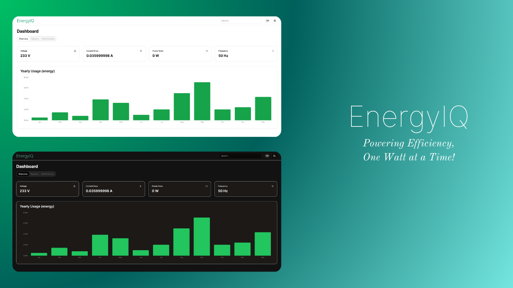

# EnergyIQ

EnergyIQ is a Software as a Service (SaaS) solution designed to provide real-time energy data visualization in a dashboard-style format. It captures energy-related data using an ESP8266 microcontroller chip, which reads data from energy sources. This data is then written to a MongoDB Atlas database every 3 seconds. The real-time energy data is seamlessly integrated into a dashboard UI built with the NextJS 14 framework. The UI is constructed using shadcn UI components for consistency and responsiveness and styled with the TailwindCSS framework.

## Table of Contents

- [Features](#features)
- [Technology Stack](#technology-stack)
- [Getting Started](#getting-started)
  - [Prerequisites](#prerequisites)
  - [Installation](#installation)

## Features

- Real-time energy data visualization.
- Seamless integration of physical energy sources with digital infrastructure.
- Responsive and consistent user interface design for enhanced user experience (including Dark Mode)

## Technology Stack

EnergyIQ is built using the following technologies:

1. **NextJS:** A framework built on React, focusing on server-side rendering for web applications.
2. **TypeScript:** A language extending JavaScript with static typing to enhance code reliability.
3. **MongoDB:** A database designed for storing and handling application data, utilizing a NoSQL approach.
4. **ESP8266:** An IoT microcontroller chip utilized for reading data from devices and transmitting it to the MongoDB database.
5. **shadcn UI:** A library of user interface components aimed at creating a cohesive and adaptable UI.
6. **Tailwind CSS:** A CSS framework emphasizing utility classes for styling web applications efficiently.
<!-- 6. **Clerk:** For authentication and user management (basic, SSO) -->

## Getting Started

#### Prerequisites

- Node.js installed: https://nodejs.org/en
- MongoDB server running

#### Installation

1. Clone the repository: `git clone https://github.com/aleksanderpulla/EnergyIQ.git`
2. Navigate to the project directory: `cd EnergyIQ`
3. Install dependencies: `npm install`
4. Contact aleksanderpulla@gmail.com for a template of ".env" file, containing all the referenced environment variables of the application
5. Update `esp8266.ino` file by defining the hostname of your machine, as well as the wireless connectivity of the microcontroller chip (instructions are given in comments of `esp8266.ino` file)
6. Start the application: `npm run dev` or `yarn dev` or `pnpm dev`
7. Open [http://localhost:3000](http://localhost:3000) with your browser to see the result.
